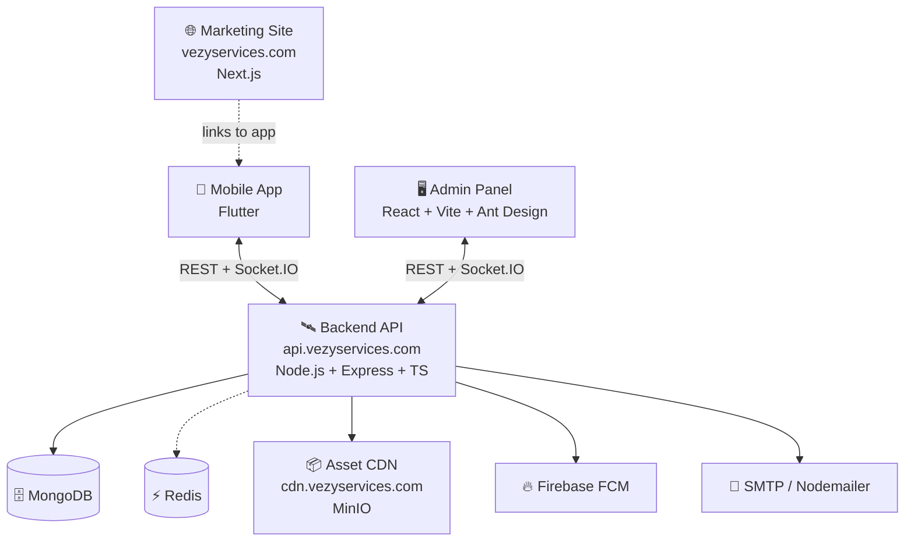

<div align="center">

# 🧡 Vezy

### _Tap. Book. Relax._

**Your everyday home services, one tap away.**

A dual‑sided, real‑time service marketplace built with **Flutter**, **Node.js**, and **React** — connecting customers with verified professionals for cleaning, repairs, plumbing, electrical work, pest control and more.

---

<a href="https://vezyservices.com/"></a>
<a href="https://play.google.com/store/apps/details?id=com.vezyservices.app"></a>

---


</div>

---

## 📸 App Preview

<div align="center">

|         🏠 Home & Services         |        📋 Booking History         |      👤 Profile & Settings       |
| :--------------------------------: | :-------------------------------: | :------------------------------: |
|               | .webp>) | .webp>) |
| _Browse verified pros by category_ |  _Track every job in real‑time_   |  _Personalize your experience_   |

</div>

---

## ⬇️ Download the App

<div align="center">

<a href="https://play.google.com/store/apps/details?id=com.vezyservices.app">
  
</a>

<br/>

📦 **Package:** `com.vezyservices.app` &nbsp;·&nbsp; 🤖 **Requires:** Android 5.0+ (API 21+)

<br/>

[**👉 Install Vezy now**](https://play.google.com/store/apps/details?id=com.vezyservices.app) &nbsp;·&nbsp; [**⭐ Leave a review**](https://play.google.com/store/apps/details?id=com.vezyservices.app#reviews)

</div>

---

## 🌟 Why Vezy?

> _"Hi"_ — Vezy greets every user with warmth, because home services should feel like welcoming a trusted friend.

Vezy is designed for the way people **actually** live — busy, on the move, and short on time. Whether you need a deep clean before guests arrive, an AC fix in the middle of summer, or a last‑minute plumber, Vezy gets a verified pro to your door without the back‑and‑forth calls and texts.

Two sides, one binary:

- 👤 **Customers** discover, book and pay for services
- 🛠️ **Service Providers** manage their catalog, accept jobs, earn and get reviewed

A single account, a single tap, and a role switch (`userRoleProvider`) instantly flips the entire UI between the two experiences — no logout needed.

---

## ✨ Features

### 👤 Customer App

- � **Smart Discovery** — Categorized grids, banners, recommendations and reviews on the home dashboard
- �️ **Provider Profiles** — Ratings, bios, offered services and historical feedback
- 📅 **Effortless Booking** — Configure parameters, pick a slot, confirm
- 🕒 **Live Booking History** — Status pipeline with dynamic timelines (`timelines_plus`)
- 💬 **Real‑Time Chat** — Socket.IO 1‑on‑1 messaging with media sharing (`socket_io_client`)
- ⭐ **Post‑Service Reviews** — Rate, comment and attach photographic evidence
- � **PDF Invoices** — Auto‑generated receipts via `syncfusion_flutter_pdf`
- 🔐 **Biometric Sign‑In** — Face ID (iOS) / Fingerprint (Android) via `local_auth`
- 🌐 **Localized** — `flutter_localization` for multi‑region support
- 🚦 **Update Gate** — Splash‑screen version check with optional or forced update flows

### 🛠️ Provider App _(same binary, role‑switched)_

- � **Business Dashboard** — Active jobs, today's schedule, pending requests, stats
- �️ **Catalog Management** — Add / edit / toggle services, set pricing tiers and durations
- � **Earnings & Withdrawals** — Ledger, pending payouts, structured cash‑out
- 🌟 **Reputation Log** — Customer feedback with images and rating summaries
- 🛎️ **Real‑Time Job Inbox** — Socket.IO push of new bookings ready to accept

### 🖥️ Admin Console _(web)_

- 📊 **Dashboard Analytics** — User growth, earnings, recent bookings (`chart.js`)
- 👥 **User Management** — Toggle active/inactive status
- 💸 **Withdrawals & Refunds** — Approve / reject with audit trail
- � **Reviews Moderation** — Read and remove abusive reviews
- 📜 **Configuration** — Edit global app configuration

### 🛰️ Backend API

- 🔐 JWT auth (access + refresh) with email & phone OTP
- 🗄️ MongoDB + Mongoose ODM
- � Image uploads (local + S3‑ready via `@aws-sdk/client-s3`)
- 📧 Transactional email via `nodemailer`
- 🔥 Firebase push notifications (`firebase-admin`)
- � Real‑time events over Socket.IO (Redis adapter for horizontal scale)
- 📖 Auto‑generated Swagger docs at `/api-docs`
- 🪵 Winston structured logging

---

## 🏗️ Architecture



---

## 🧩 Tech Stack

### 📱 Mobile — `saurabh1goel79-app/` (Flutter)

| Concern                | Technology                                                                      |
| ---------------------- | ------------------------------------------------------------------------------- |
| **Language**           | Dart ^3.10                                                                      |
| **State Management**   | `flutter_riverpod` v3                                                           |
| **Routing**            | `go_router` v17                                                                 |
| **Networking**         | `dio` + `retrofit` (type‑safe REST)                                             |
| **Real‑Time**          | `socket_io_client`                                                              |
| **Local Cache**        | `shared_preferences`                                                            |
| **Biometric Auth**     | `local_auth`                                                                    |
| **Push Notifications** | `firebase_messaging` + `flutter_local_notifications`                            |
| **PDF Invoices**       | `syncfusion_flutter_pdf`                                                        |
| **Media**              | `image_picker`, `cached_network_image`, `flutter_svg`                           |
| **UI Polish**          | `flutter_animate`, `google_fonts`, `skeletonizer`, `toastification`             |
| **Forms & Validation** | `form_builder_validators`, `pinput`, `dropdown_button2`                         |
| **Localization**       | `flutter_localization`, `intl`                                                  |
| **Code Generation**    | `build_runner`, `retrofit_generator`, `json_serializable`, `flutter_gen_runner` |

### 🛰️ Backend — `Backend/` (Node.js + TypeScript)

| Concern             | Technology                                 |
| ------------------- | ------------------------------------------ |
| **Runtime**         | Node.js 20                                 |
| **Framework**       | Express 5                                  |
| **Language**        | TypeScript 5                               |
| **Database**        | MongoDB + Mongoose 9                       |
| **Auth**            | JWT (`jsonwebtoken`) + bcrypt              |
| **Real‑Time**       | `socket.io` 4 + `@socket.io/redis-adapter` |
| **Validation**      | `express-validator`                        |
| **Uploads**         | `multer` + AWS S3 SDK                      |
| **Push**            | `firebase-admin`                           |
| **Mail**            | `nodemailer`                               |
| **Docs**            | `swagger-jsdoc` + `swagger-ui-express`     |
| **Logging**         | `winston` + `morgan`                       |
| **Process Manager** | PM2 (production)                           |

### 🖥️ Admin Panel — `Admin-Panel/` (React)

| Concern       | Technology                      |
| ------------- | ------------------------------- |
| **Framework** | React 19                        |
| **Bundler**   | Vite 7 (with React Compiler)    |
| **Language**  | TypeScript 5                    |
| **UI Kit**    | Ant Design 6 + Tailwind CSS 4   |
| **State**     | Redux Toolkit + React Redux     |
| **Routing**   | React Router 7                  |
| **HTTP**      | Axios                           |
| **Charts**    | Chart.js + react-chartjs-2      |
| **Rich Text** | Jodit React                     |
| **PDF**       | `@react-pdf/renderer`           |
| **Icons**     | Ant Design Icons + Lucide React |
| **Real‑Time** | socket.io-client                |
| **Cookies**   | js-cookie                       |
| **Hosting**   | Vercel (`vercel.json` present)  |

---

## 📂 Project Structure

This repo is a **monorepo** with three production packages plus this screenshot showcase folder.

```
VezyServices/
├── 📱 App/           ← Flutter mobile app (Android + iOS)
│   ├── lib/
│   │   ├── main.dart                # Entry point + provider overrides
│   │   ├── core/                    # Infrastructure & shared logic
│   │   │   ├── data/                #   providers/, service/
│   │   │   │                        #     ├── cache/      (SharedPreferences)
│   │   │   │                        #     ├── network/    (Dio + Retrofit)
│   │   │   │                        #     ├── socket/     (Socket.IO)
│   │   │   │                        #     └── notification/
│   │   │   ├── routes/              #   GoRouter configuration
│   │   │   ├── static/              #   theme/, const/, extensions/, utils/
│   │   │   └── gen/                 #   auto-generated assets & l10n
│   │   ├── data/                    # Feature data layer
│   │   │   ├── auth/                #   data/ domain/ provider/
│   │   │   ├── bookings/
│   │   │   ├── messages/
│   │   │   ├── review/
│   │   │   ├── service_and_subservice/
│   │   │   ├── service_provider/
│   │   │   ├── settings/
│   │   │   ├── user/
│   │   │   └── files/
│   │   └── src/                     # UI layer
│   │       ├── module/
│   │       │   ├── user/            #   Customer screens
│   │       │   ├── service_provider/#   Provider screens
│   │       │   └── common/          #   Auth, Messages, Settings
│   │       └── widgets/             # Reusable UI library
│   ├── android/                     # Android shell + permissions
│   ├── ios/                         # iOS shell + Info.plist permissions
│   ├── assets/                      # images/, icons/, review/, why_us/
│   ├── scripts/                     # extract_strings.py
│   ├── test/                        # widget_test.dart
│   ├── pubspec.yaml
│   └── PROJECT_DOCUMENTATION.md     # Full deployment & permissions guide
│
├── 🛰️ Backend/                      ← Node.js + Express + TypeScript API
│   ├── src/
│   │   ├── index.ts                 # Bootstrap (Express + Socket.IO)
│   │   └── utils/seed.ts            # DB seeder
│   ├── postman/                     # Postman collections & environments
│   ├── uploads/                     # Local file storage (writable)
│   ├── logs/                        # Winston logs (writable)
│   ├── .env                         # Environment variables
│   ├── package.json                 # Scripts: dev / build / start / seed
│   └── tsconfig.json
│
└── 🖥️ Admin-Panel/                  ← React + Vite web admin console
    ├── src/                         # Pages, components, redux slices
    ├── public/                      # Static assets
    ├── index.html
    ├── vite.config.ts
    ├── eslint.config.js
    ├── vercel.json                  # Vercel deployment config
    └── package.json                 # Scripts: dev / build / lint / preview
```

---

## 🔌 Backend API (Highlights)

Base URL: `http://<SERVER_IP>:2526/api` &nbsp;·&nbsp; Swagger: `/api-docs`

| Group                       | Endpoints                                                                           |
| --------------------------- | ----------------------------------------------------------------------------------- |
| **Auth**                    | register, verify-email, login, login-phone, refresh-token, me, update-me, addresses |
| **Users** _(admin)_         | list, create, get, update, delete, toggle-status                                    |
| **Services & Sub‑Services** | full CRUD, popular, by-type, by-service                                             |
| **Bookings**                | create, list (with filters), by-provider, status, accept, additional-service        |
| **Dashboard** _(admin)_     | stats, user-statistics, earning-statistics, recents                                 |
| **Withdrawals**             | create (provider), list (admin/my), approve/reject                                  |
| **Reviews**                 | create, by-provider, admin list, delete                                             |
| **Refunds**                 | create, list (admin/my), approve/reject                                             |
| **Messages**                | conversations CRUD, send/read messages                                              |
| **Notifications**           | list, unread-count, read-all, FCM device-token register/unregister                  |
| **Upload**                  | single image (`multipart/form-data`, field `image`)                                 |

### 🔴 Realtime (Socket.IO)

Connect to `http://<SERVER_IP>:2526` and send JWT in `auth.token`.

**Server events:** `booking.created`, `booking.accepted`, `booking.updated`, `booking.deleted`, `withdrawal.created`, `withdrawal.updated`, `refund.created`, `refund.updated`, `conversation.created`, `message.created`, `message.read`

**Client events:** `conversation:join`, `conversation:leave`, `message:send`, `conversation:read`

### 🌐 Production endpoints

| Service | URL |
|---------|-----|
| Marketing site | [vezyservices.com](https://vezyservices.com/) |
| REST API base | [api.vezyservices.com/api](https://api.vezyservices.com/api) |
| API health | [api.vezyservices.com/](https://api.vezyservices.com/) |
| Swagger docs | [api.vezyservices.com/api-docs](https://api.vezyservices.com/api-docs) |
| Asset CDN | [cdn.vezyservices.com](https://cdn.vezyservices.com) |

---

## 🛡️ Platform Permissions

### Android — declared in `android/app/src/main/AndroidManifest.xml`

`INTERNET` · `ACCESS_NETWORK_STATE` · `CAMERA` · `READ_EXTERNAL_STORAGE` · `WRITE_EXTERNAL_STORAGE` · `RECORD_AUDIO` · `USE_BIOMETRIC` · `POST_NOTIFICATIONS`

### iOS — declared in `ios/Runner/Info.plist`

`NSCameraUsageDescription` · `NSMicrophoneUsageDescription` · `NSPhotoLibraryUsageDescription` · `NSFaceIDUsageDescription` · `UIBackgroundModes: fetch + remote-notification`

---

## 🗺️ Roadmap

- [x] Customer + Provider dual‑role Flutter app
- [x] Real‑time chat & booking pipeline via Socket.IO
- [x] PDF invoices & biometric sign‑in
- [x] Admin web console with analytics
- [x] Push notifications (Firebase)
- [ ] In‑app payments integration
- [ ] Provider availability calendar
- [ ] Multi‑city marketplace expansion
- [ ] iOS App Store release

---

## 🤝 Contributing

1. � Fork the repo
2. 🌿 Create a feature branch (`git checkout -b feature/amazing-thing`)
3. 💾 Commit your changes (`git commit -m 'Add amazing thing'`)
4. 📤 Push to the branch (`git push origin feature/amazing-thing`)
5. 🔁 Open a Pull Request

---

## 📄 License

Distributed under the **MIT License**. See `LICENSE` for more information.

---

## 💌 Get in Touch

Have a question, idea or partnership in mind?

- 🌐 **Website:** [**vezyservices.com**](https://vezyservices.com/)
- 📱 **App:** [**Vezy on Google Play**](https://play.google.com/store/apps/details?id=com.vezyservices.app) &nbsp;·&nbsp; `com.vezyservices.app`
- 📧 **Email:** [vezyservices@gmail.com](mailto:vezyservices@gmail.com)
- 💬 **Issues:** [Open one](../../issues)

---

<div align="center">

**Built with 🧡 by the Vezy team**

_Tap. Book. Relax._

</div>
